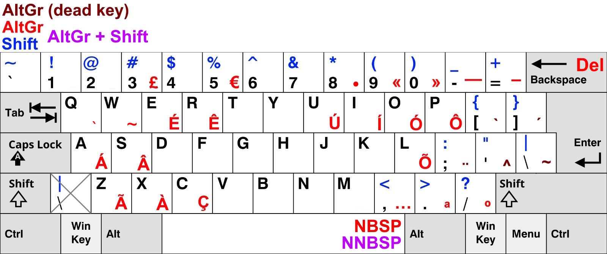

# US-PT Keyboard Layout
A superset of the US keyboard layout created for Portuguese speakers. Unlike alternatives such as the international US layout, it retains all original keybindings of the US keyboard layout, expanding upon it exclusively through AltGr keybindings.

## Why?
I was fed up of unwieldy shortcuts caused by my use of the Portuguese keyboard layout in programs where shortcuts were designed with the US keyboard in mind (pretty much all of them). Alternatives like the international US layout also proved unsatisfactory. Rather than strictly expanding upon the default US layout, they replace existing keybindings. Save for the fact European keyboards are usually ISO (tall Enter, key between Left Shift and Z), a user of the default US keyboard layout would be able to use this custom layout without noticing any difference. This ensures 

## Choices
| Symbol(s) | Location    | Reason                                                                         |
|-----------|-------------|--------------------------------------------------------------------------------|
| £         | AltGr + 3   | Same as PT layout                                                              |
| €         | AltGr + E   | Same as PT layout, E for Euro                                                  |
| Ç         | AltGr + C   | AltGr intuitively adds the cedilla                                             |
| ` and ´   | [ and ]     | The accents mirror each other, just like the brackets                          |
| ~         | AltGr + \|  | Tilde position on PT layout                                                    |
| ^         | AltGr + '   | Tilde already took its PT position, shifted it to the left                     |
| ¨         | AltGr + ;   | Unnecessary, just shoved it there because I wanted the ordinals to be together |
|ª and º    | . and /     | Bottom-right of the keyboard, positioned next to each other                    |